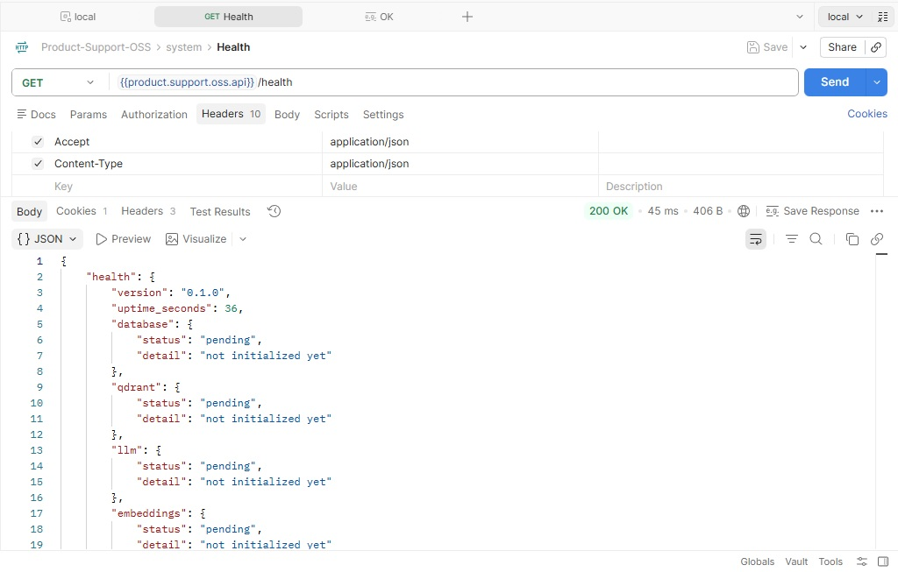
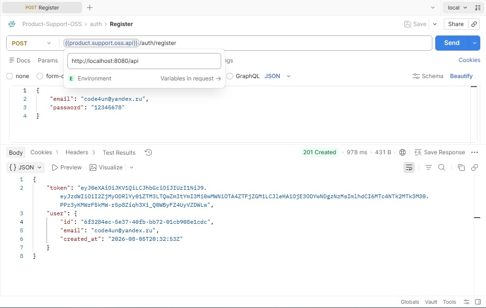
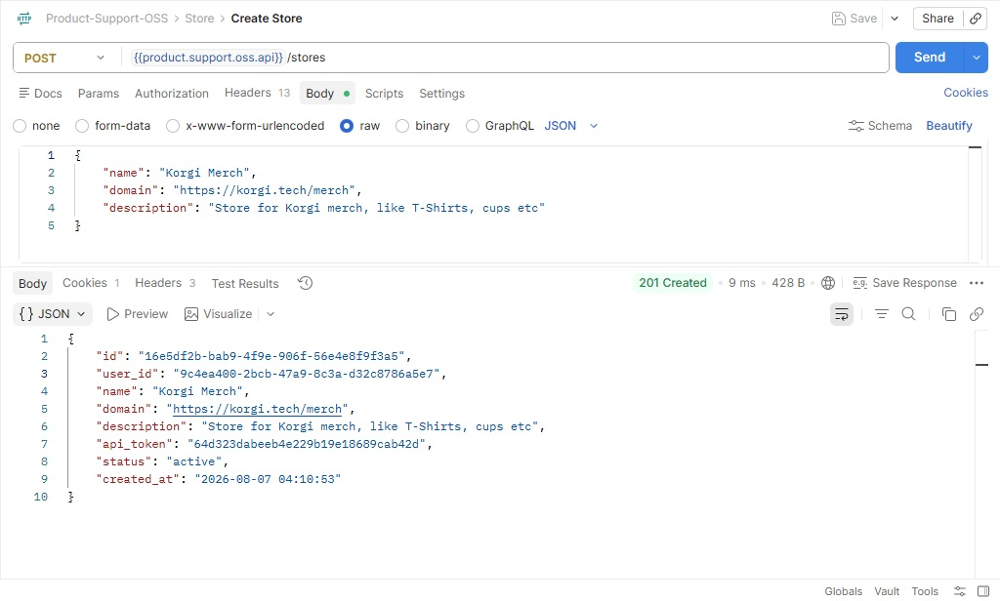

# 🛍️ Product Support OSS

AI support assistant for e-commerce product catalogs. Built with Rust, Axum, Qwen 2.5, SQLite, Docker, and Nuxt 3.

The system indexes stores, products, technical specifications, and descriptions, then answers customer support questions using grounded RAG retrieval.


---

## 🚀 О проекте

`Product Support OSS` — это open-source RAG-ассистент технической поддержки для e-commerce.

Проект решает типовую боль интернет-магазинов:

> Покупатели и менеджеры постоянно задают одни и те же вопросы о товарах: характеристики, совместимость, комплектация, гарантия, применение, отличия моделей, уход и условия возврата.

Вместо ручного поиска по карточкам товаров система:

1. Принимает вопрос пользователя.
2. Определяет магазин и контекст.
3. Ищет релевантные товары, характеристики и описания.
4. Строит grounded prompt.
5. Отвечает через локальную LLM `Qwen 2.5`.
6. Показывает источники: товары, спецификации и использованные поля.

Проект можно использовать как:

- 🧪 демо AI Engineering навыков;
- 🏬 AI-помощник поддержки для интернет-магазина;
- 🧱 фундамент для коммерческого `korgi.support`;
- 🔌 основу для будущей интеграции с PIM/ERP/e-commerce системами;
- 🌌 RAG-модуль внутри экосистемы `Korgi.tech`.

---

## 💡 Бизнес-кейс

Это идеальный e-commerce кейс для снижения нагрузки на техническую поддержку.

### Проблема

В интернет-магазине есть:

- сотни или тысячи товаров;
- описания;
- технические характеристики;
- комплектация;
- FAQ;
- инструкции;
- политика возврата;
- условия доставки;
- гарантийные правила.

Поддержка тратит много времени на ответы вида:

- «Чем отличается модель A от модели B?»
- «Подходит ли этот чехол для телефона X?»
- «Какая мощность у этого товара?»
- «Что входит в комплект?»
- «Есть ли гарантия?»
- «Можно ли стирать эту футболку?»
- «Какие размеры доступны?»
- «Как оформить возврат?»

### Решение

Система индексирует данные магазина и отвечает на вопросы по фактическим данным товаров.

Пользователь получает:

- ⚡ быстрый ответ;
- 📦 ссылки на товары;
- 🧾 использованные характеристики;
- 📉 понижение количества типовых обращений;
- 🧑‍💼 более быстрый onboarding менеджеров;
- 🤖 первую линию поддержки перед человеком.

---

## ✨ Ключевые возможности

- 🏬 **Stores**: пользователь создаёт магазин.
- 📦 **Products**: у магазина есть товары с описаниями и характеристиками.
- 🧠 **RAG support assistant**: ответы только по данным магазина.
- 🤖 **Qwen 2.5 LLM**: локальный запуск через Docker.
- 📥 **Manual ingestion**: добавление магазинов и товаров вручную.
- 🔌 **API-first**: магазины и товары можно создавать через REST API.
- 🧩 **PIM-ready architecture**: готовность к будущим интеграциям с PIM/ERP/e-commerce системами.
- 📚 **Sources and citations**: ответ показывает, какие товары и поля использованы.
- 💾 **SQLite WAL**: простое локальное хранение для OSS-демо.
- 🧾 **Token usage tracking**: учёт токенов, latency и ошибок.
- 📈 **Dashboard**: метрики использования и качества.
- 🔁 **Reindexing**: обновление базы знаний после изменения товаров.
- 🖥️ **Nuxt 3 UI**: чат, магазины, товары, история и dashboard.
- 🧪 **Evaluation-ready**: возможность тестировать качество ответов.

---

## 📸 Скриншоты

### API: Health-Check


### API: Register


### API: Register


- **Интерфейс: Чат поддержки**
- **Главный интерфейс: Магазины**
- **Главный интерфейс: Товары**
- **Главный интерфейс: Результат ответа**
- **Dashboard: Token usage и latency**
- **History: История диалогов**

---

## 🛠 Технологический стек

| Компонент | Технология | Назначение |
| --- | --- | --- |
| Backend | Rust, Axum | REST API, RAG orchestration, ingestion, chat |
| Frontend | Nuxt 3, Vue 3, TypeScript | UI для чата, магазинов, товаров и dashboard |
| Database | SQLite, WAL mode | Магазины, товары, chunks, history, usage |
| LLM | Qwen 2.5 | Локальная генерация ответов |
| Embeddings | Local embedding model | Векторный поиск по товарным данным |
| Infrastructure | Docker, Docker Compose | Быстрый локальный запуск |

---

## 💻 Требования

Проект рассчитан на локальный запуск и demo-использование.

Проект поддерживает 2 режима:

- **Standalone** — полностью локальная LLM через Docker.
- **Lightweight** — внешний OpenAI-compatible LLM provider.

### Аппаратные требования для Standalone

- CPU: x64/ARM, 4+ ядра рекомендуется
- RAM: 16 GB рекомендуется для локальной LLM
- Disk: 10 GB для моделей, SQLite и данных
- GPU: опционально, если runtime поддерживает offload

### Аппаратные требования для Lightweight

- CPU: 2+ ядра
- RAM: 2 GB достаточно для backend и frontend
- Disk: 1 GB для SQLite и данных

### Программные требования

Для запуска через Docker:

- Docker Engine 20.10+
- Docker Compose v2+

Для локальной разработки:

- Rust `1.97+`
- Node.js `18+`
- SQLite3

---

## 🏁 Быстрый старт

### Standalone version

Создайте `.env.standalone` из шаблона:

```bash
cp .env.standalone.template .env.standalone
```

Заполните переменные окружения.

Запустите проект с локальной LLM:

```bash
docker compose --env-file .env.standalone -f standalone.compose.yml up -d --build
```

Проверьте логи LLM runtime:
```bash
docker compose logs -f llm
```

После запуска:
- Frontend: http://localhost:3000
- Backend API: http://localhost:8081
- API docs: http://localhost:8081/api/docs

Первый запуск может занять время из-за загрузки и подготовки моделей.

### Local development

1. Запустить backend
    ```bash
   cd backend
   cargo run
   ```
2. Запустить frontend
    ```bash
   cd frontend
   npm install
   npm run dev
   ```

### 🧪 Test API

Создать магазин:

```bash
curl -X POST http://localhost:8081/api/v1/stores \
  -H "Content-Type: application/json" \
  -d '{
    "name": "Demo Store",
    "domain": "demo.example.com"
  }'
```

Добавить товар:

```bash
curl -X POST http://localhost:8081/api/v1/stores/{store_id}/products \
  -H "Content-Type: application/json" \
  -d '{
    "name": "Wireless Headphones X200",
    "description": "Over-ear wireless headphones with active noise cancellation",
    "specs": {
      "battery_life": "30 hours",
      "bluetooth_version": "5.3",
      "weight": "250g"
    },
    "warranty_months": 24,
    "price": 129.99
  }'
```

Переиндексировать базу знаний:

```bash
curl -X POST http://localhost:8081/api/v1/ingest/reindex
```

Задать вопрос поддержки:

```bash
curl -X POST http://localhost:8081/api/v1/chat \
  -H "Content-Type: application/json" \
  -d '{
    "store_id": "store_123",
    "message": "Сколько часов держит батарея у Wireless Headphones X200?"
  }'
```

Пример ответа:

```json
{
  "answer": "Wireless Headphones X200 держит заряд до 30 часов в режиме воспроизведения музыки при выключенном ANC.",
  "confidence": "high",
  "sources": [
    {
      "product_id": "prod_9f21",
      "product_name": "Wireless Headphones X200",
      "fields_used": [
        "specs.battery_life",
        "description"
      ]
    }
  ],
  "usage": {
    "prompt_tokens": 512,
    "completion_tokens": 48,
    "latency_ms": 640
  },
  "conversation_id": "conv_7ac31",
  "created_at": "2026-08-03T12:00:00Z"
}
```

---

## 🔌 API Документация

Сервис предоставляет REST API для интеграции.

### Stores

- `POST /api/v1/stores` — создать магазин.
- `GET /api/v1/stores` — список магазинов.
- `GET /api/v1/stores/{id}` — получить магазин.
- `PATCH /api/v1/stores/{id}` — обновить магазин.
- `DELETE /api/v1/stores/{id}` — удалить магазин.

### Products

- `POST /api/v1/stores/{store_id}/products` — добавить товар.
- `GET /api/v1/stores/{store_id}/products` — список товаров.
- `GET /api/v1/products/{id}` — получить товар.
- `PATCH /api/v1/products/{id}` — обновить товар.
- `DELETE /api/v1/products/{id}` — удалить товар.

### Ingestion

- `POST /api/v1/ingest/reindex` — переиндексировать базу знаний.
- `GET /api/v1/ingest/status` — статус индексации.
- `GET /api/v1/documents` — список indexed chunks.

### Chat

- `POST /api/v1/chat` — задать вопрос поддержки.
- `GET /api/v1/conversations` — список диалогов.
- `GET /api/v1/conversations/{id}/messages` — история диалога.

### Metrics

- `GET /api/v1/metrics/summary` — token usage, latency, errors.

Полная документация доступна по адресу `/api/docs` после запуска Swagger UI.

---

## 🧩 Архитектура

```text
.
├── backend/               # Rust + Axum REST API
│   ├── src/
│   │   ├── api/            # HTTP handlers (stores, products, chat, ingest)
│   │   ├── rag/            # retrieval + prompt building
│   │   ├── db/             # SQLite models
│   │   └── llm/            # Qwen 2.5 client
│   └── migrations/
├── frontend/               # Nuxt 3 + Vue 3 UI
│   └── pages/
├── docker-compose.yml
├── .env.standalone.template
└── .env.light.template
```

Backend отвечает за:

- приём магазинов и товаров;
- валидацию данных;
- chunking описаний и характеристик;
- embedding generation;
- retrieval;
- построение grounded prompt;
- вызов LLM;
- сохранение истории;
- token usage и latency metrics.

LLM runtime изолирован и доступен внутри Docker-сети.

---

## 📈 Dashboard

Встроенный dashboard показывает:

- количество магазинов;
- количество товаров;
- количество indexed chunks;
- количество чатов;
- success rate;
- cache hit rate;
- суммарный расход токенов;
- среднюю и p95 latency;
- последние ошибки;
- low-confidence answers.

Это важно не только для демо, но и для будущего коммерческого использования: AI-интеграции должны быть наблюдаемыми с первого дня.

---

## 🌌 Экосистема Korgi

Этот проект является частью open-source экосистемы Korgi.tech.

| Проект | Назначение |
| --- | --- |
| Korgi.Beats | Beat detection и аудио-ритм для видео-монтажа |
| Korgi.Vision | Понимание изображений: теги, качество, товар |
| Korgi.Support | RAG-ассистент по документации и знаниям |
| Product Support OSS | RAG-ассистент поддержки для e-commerce товаров |
| Korgi.Scenes | Планируется: scene detection и нарезка видео |
| Korgi.Sentiment | Анализ тональности текста |

Product Support OSS лежит в основе будущего коммерческого продукта `korgi.support` и расширяет RAG-подход с документации до товарных каталогов e-commerce.

---

## 🧱 Roadmap

- [x] Базовый Rust API
- [x] SQLite persistence
- [x] Nuxt UI skeleton
- [x] Token usage tracking concept
- [x] Stores API
- [x] Products API
- [x] Product knowledge chunking
- [x] Local Qwen 2.5 chat integration
- [x] Embeddings and retrieval
- [x] Source citations
- [x] Reindexing
- [x] Dashboard
- [ ] Evaluation dataset
- [ ] CSV product import
- [ ] PIM integration adapter
- [ ] Commercial SaaS extensions

---

## 🤝 Contributing

Pull Requests приветствуются!

Особенно интересны улучшения:

- retrieval quality;
- chunking product specs;
- source citation format;
- evaluation dataset;
- UI/UX for stores/products;
- PIM integration adapters;
- Docker deployment stability.

Перед отправкой PR желательно выполнить:

```bash
cargo fmt --all
cargo test
```

### Migrations

Установка утилиты для создания миграций:

```bash
cargo install sqlx-cli
```

Создание миграций:

```bash
sqlx migrate add create_stores_table
sqlx migrate add create_products_table
sqlx migrate add create_chunks_table
sqlx migrate add create_conversations_table
sqlx migrate add create_messages_table
sqlx migrate add create_token_usage_table
sqlx migrate add create_indexes
```

Применение миграций:

```bash
sqlx migrate run
```

---

## 📄 License

Этот проект распространяется под лицензией MIT. См. файл LICENSE для подробностей.

---

## ⭐ Self-promo note

This repository is part of the Korgi.tech open-source ecosystem and demonstrates practical AI Engineering skills:

- Rust backend design;
- RAG pipelines;
- local LLM integration;
- structured product knowledge indexing;
- token usage observability;
- e-commerce support automation;
- Dockerized deployment;
- Nuxt 3 frontend.

It also acts as the foundation for the future commercial product `korgi.support`.
